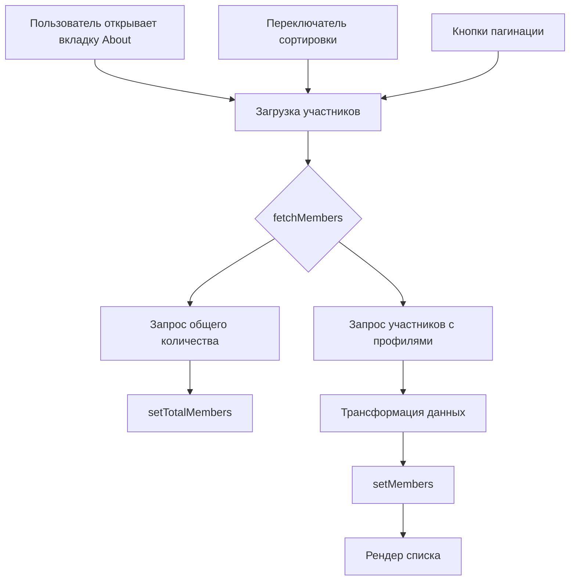

# План: Список участников сообщества на странице /About

## Цель
Добавить на странице `/community/:id` во вкладке "About" список участников сообщества с:
- Имя участника
- Фото (avatar)
- Рейтинг
- Количество дней в сообществе

## Требования
1. Список показывается во вкладке "About" (существующий таб)
2. Переключатель сортировки:
   - По дате вступления (новые/старые)
   - По рейтингу (высокий/низкий)
3. Пагинация по 20 участников на странице

## Структура данных

### Тип CommunityMember
```typescript
interface CommunityMember {
  id: string;                    // community_members.id
  user_id: string;               // community_members.user_id
  joined_at: string;             // community_members.joined_at
  role: string;                  // community_members.role
  is_active: boolean;            // community_members.is_active
  // Данные из профиля
  real_name: string | null;      // profiles.real_name
  avatar_url: string | null;     // profiles.avatar_url
  rating: number | null;         // profiles.rating
  // Вычисляемые поля
  days_in_community: number;     // days since joined_at
}
```

## Изменения в src/pages/Community.tsx

### 1. Добавить тип CommunityMember
```typescript
interface CommunityMember {
  id: string;
  user_id: string;
  joined_at: string;
  role: string;
  is_active: boolean;
  real_name: string | null;
  avatar_url: string | null;
  rating: number | null;
}
```

### 2. Добавить состояние
```typescript
const [members, setMembers] = useState<CommunityMember[]>([]);
const [membersLoading, setMembersLoading] = useState(false);
const [sortBy, setSortBy] = useState<'joined_at' | 'rating'>('joined_at');
const [sortOrder, setSortOrder] = useState<'desc' | 'asc'>('desc');
const [currentPage, setCurrentPage] = useState(1);
const [totalMembers, setTotalMembers] = useState(0);
const MEMBERS_PER_PAGE = 20;
```

### 3. Добавить функцию fetchMembers
```typescript
const fetchMembers = async () => {
  if (!id) return;
  
  setMembersLoading(true);
  
  // Получаем общее количество участников
  const { count } = await supabase
    .from('community_members')
    .select('id', { count: 'exact', head: true })
    .eq('community_id', id)
    .eq('is_active', true);
  
  setTotalMembers(count || 0);
  
  // Получаем участников с джоином профилей
  const { data, error } = await supabase
    .from('community_members')
    .select(`
      id,
      user_id,
      joined_at,
      role,
      is_active,
      profiles:user_id (
        real_name,
        avatar_url,
        rating
      )
    `)
    .eq('community_id', id)
    .eq('is_active', true)
    .order(sortBy, { ascending: sortOrder === 'asc' })
    .range(
      (currentPage - 1) * MEMBERS_PER_PAGE,
      currentPage * MEMBERS_PER_PAGE - 1
    );
  
  if (!error && data) {
    // Трансформируем данные
    const transformed = data.map(item => ({
      ...item,
      ...item.profiles,
      days_in_community: Math.floor(
        (new Date().getTime() - new Date(item.joined_at).getTime()) / (1000 * 60 * 60 * 24)
      )
    }));
    setMembers(transformed);
  }
  
  setMembersLoading(false);
};
```

### 4. Обновить useEffect для вызова fetchMembers
```typescript
useEffect(() => {
  fetchMembers();
}, [id, sortBy, sortOrder, currentPage]);
```

### 5. Обновить рендер таба "About"
```typescript
{activeTab === "about" && (
  <div className="bg-card rounded-xl border border-border overflow-hidden">
    {/* Description */}
    {community.description && (
      <div className="px-6 pt-6 pb-4">
        <p className="text-muted-foreground whitespace-pre-wrap">{community.description}</p>
      </div>
    )}
    
    {/* Rich content */}
    {community.content_html && (
      <div className="px-6 pb-6">
        <div
          className="prose prose-sm max-w-none dark:prose-invert"
          dangerouslySetInnerHTML={{ __html: community.content_html }}
        />
      </div>
    )}
    
    {/* Members List */}
    <div className="px-6 py-4 border-t border-border">
      <div className="flex items-center justify-between mb-4">
        <h3 className="font-semibold text-lg">
          {language === "ru" ? "Участники" : "Members"} ({totalMembers})
        </h3>
        
        {/* Sort Switcher */}
        <div className="flex items-center gap-2">
          <Button
            variant={sortBy === 'joined_at' ? "default" : "ghost"}
            size="sm"
            onClick={() => {
              setSortBy('joined_at');
              setCurrentPage(1);
            }}
          >
            {language === "ru" ? "По дате" : "By date"}
          </Button>
          <Button
            variant={sortBy === 'rating' ? "default" : "ghost"}
            size="sm"
            onClick={() => {
              setSortBy('rating');
              setCurrentPage(1);
            }}
          >
            {language === "ru" ? "По рейтингу" : "By rating"}
          </Button>
          <Button
            variant="ghost"
            size="sm"
            onClick={() => {
              setSortOrder(prev => prev === 'asc' ? 'desc' : 'asc');
            }}
          >
            {sortOrder === 'asc' ? '↑' : '↓'}
          </Button>
        </div>
      </div>
      
      {/* Members Grid/List */}
      {membersLoading ? (
        <div className="flex justify-center py-8">
          <Loader2 className="h-6 w-6 animate-spin text-primary" />
        </div>
      ) : members.length === 0 ? (
        <div className="text-center py-8 text-muted-foreground">
          {language === "ru" ? "Нет участников" : "No members"}
        </div>
      ) : (
        <div className="grid grid-cols-1 sm:grid-cols-2 md:grid-cols-3 gap-4">
          {members.map(member => (
            <div key={member.id} className="flex items-center gap-3 p-3 rounded-lg bg-muted/50">
              <Avatar className="h-10 w-10">
                <AvatarImage src={member.avatar_url || ""} />
                <AvatarFallback>{member.real_name?.[0] || "U"}</AvatarFallback>
              </Avatar>
              <div className="flex-1 min-w-0">
                <p className="font-medium truncate">
                  {member.real_name || language === "ru" ? "Аноним" : "Anonymous"}
                </p>
                <p className="text-sm text-muted-foreground">
                  {member.rating !== null ? `⭐ ${member.rating}` : ''}
                  {member.rating !== null && member.days_in_community > 0 && ' • '}
                  {member.days_in_community > 0 
                    ? `${member.days_in_community} ${getDaysText(member.days_in_community, language)}`
                    : ''}
                </p>
              </div>
            </div>
          ))}
        </div>
      )}
      
      {/* Pagination */}
      {totalMembers > MEMBERS_PER_PAGE && (
        <div className="flex items-center justify-center gap-2 mt-4">
          <Button
            variant="outline"
            size="sm"
            onClick={() => setCurrentPage(p => Math.max(1, p - 1))}
            disabled={currentPage === 1}
          >
            {language === "ru" ? "Предыдущая" : "Previous"}
          </Button>
          <span className="text-sm text-muted-foreground">
            {currentPage} / {Math.ceil(totalMembers / MEMBERS_PER_PAGE)}
          </span>
          <Button
            variant="outline"
            size="sm"
            onClick={() => setCurrentPage(p => Math.min(Math.ceil(totalMembers / MEMBERS_PER_PAGE), p + 1))}
            disabled={currentPage >= Math.ceil(totalMembers / MEMBERS_PER_PAGE)}
          >
            {language === "ru" ? "Следующая" : "Next"}
          </Button>
        </div>
      )}
    </div>
  </div>
)}
```

### 6. Вспомогательная функция
```typescript
function getDaysText(days: number, lang: string): string {
  if (lang === 'ru') {
    if (days % 10 === 1 && days % 100 !== 11) return 'день';
    if (days % 10 >= 2 && days % 10 <= 4 && (days % 100 < 10 || days % 100 >= 20)) return 'дня';
    return 'дней';
  }
  return days === 1 ? 'day' : 'days';
}
```

## Файлы для изменения
- `src/pages/Community.tsx` - основной файл с изменениями

## Тестирование
1. Проверить отображение списка участников
2. Проверить переключатель сортировки
3. Проверить пагинацию при большом количестве участников
4. Проверить корректность подсчёта дней в сообществе
5. Проверить отображение аватаров и имён

## Схема взаимодействия

